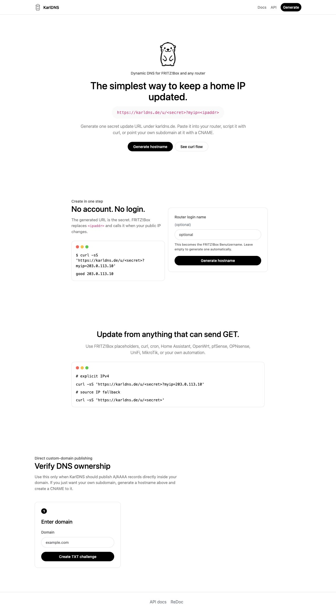
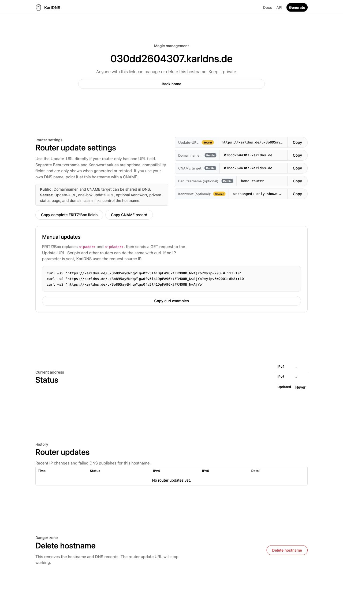
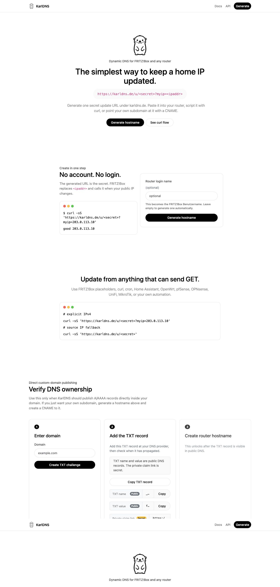

# KarlDNS

**Self-hosted DynDNS for FRITZ!Box, OpenWrt, pfSense, OPNsense, UniFi, MikroTik, and any router that can call a custom DDNS update URL.**

KarlDNS is the friendly name for `karldns`: a small FastAPI Dynamic DNS provider you can run on your own VPS. It gives users FRITZ!Box-ready DynDNS credentials, keeps public A/AAAA records updated through Cloudflare or RFC 2136, provides generated hostnames that work as CNAME targets, and supports verified custom domains with DNS TXT ownership checks.

If you want a lightweight DuckDNS / Dynu / No-IP style service that you control yourself, KarlDNS is built for that use case.



## Why KarlDNS?

- **Self-hosted Dynamic DNS provider** for home labs, small ISPs, communities, and private infrastructure.
- **FRITZ!Box compatible**: copy the generated `Update-URL`, `Domainnamen`, `Benutzername`, and `Kennwort` straight into the German FRITZ!Box DynDNS form.
- **CNAME-friendly hostnames**: users can use the generated hostname directly, or point `home.example.com` to it with a CNAME.
- **No registration required**: provider hostnames and custom-domain setup both use private magic links.
- **Custom domain support**: users enter a domain, save the private claim link, add a DNS TXT record, then press a button to verify ownership before credentials are issued.
- **Real DNS publishing** through **Cloudflare** or **RFC 2136** with A and AAAA support.
- **Small-server friendly**: FastAPI, SQLite WAL, simple Docker deployment, and no heavy background platform.
- **API first**: OpenAPI, Swagger UI, ReDoc, and JSON endpoints under `/api/v1`.

## Screenshots

### Generate Router Credentials



### Verify a Custom Domain



## What It Does

KarlDNS lets you host your own managed DynDNS service:

1. A user opens your KarlDNS URL.
2. They generate a random hostname like `a1b2c3d4.karldns.de`, or verify their own domain with a TXT record.
3. KarlDNS shows the exact router settings for the DynDNS form.
4. The router periodically calls the update URL with its current public IPv4/IPv6 address.
5. KarlDNS publishes the matching DNS records through your configured DNS backend.
6. If the user wants their own DNS name, they can create a CNAME to the generated hostname.

That means users always have a current hostname for VPN, remote access, self-hosted apps, home servers, NAS devices, and lab networks.

## Best Use Cases

- Self-hosted DynDNS for FRITZ!Box routers.
- Free DDNS service for friends, customers, a community, or a home lab.
- Dynamic DNS for IPv4 and IPv6 home internet connections.
- Custom domain DDNS with DNS TXT verification.
- CNAME target hostnames for users who want `home.example.com` without sharing DNS API access.
- Lightweight Cloudflare DDNS provider with a web UI.
- RFC 2136 / TSIG DynDNS frontend for BIND, Knot, PowerDNS, or compatible DNS servers.

## Feature Overview

| Area | Support |
| --- | --- |
| Router update URLs | FRITZ!Box custom provider URL, `/u/<slug>`, and `/nic/update` compatibility |
| DNS records | A and AAAA |
| DNS providers | Cloudflare API and RFC 2136 dynamic DNS |
| Generated hostnames | Random provider-owned names that can be used directly or as CNAME targets |
| Custom domains | TXT challenge verification before hostname creation |
| Persistence | SQLite with WAL mode |
| API | FastAPI, OpenAPI, Swagger UI, ReDoc |
| Auth model | No user accounts. Private bearer links for hostnames and custom-domain claims |
| Operations | Rate limiting, admin audit views, update logs, cleanup jobs, Docker, Caddy example |

## Quick Start

```bash
git clone https://github.com/StasonJatham/router-dyndns.git
cd router-dyndns
python3 -m venv .venv
source .venv/bin/activate
pip install -e ".[dev]"
```

Run locally:

```bash
export DDNS_ADMIN_PASSWORD='replace-with-a-long-random-value'
export DDNS_PUBLIC_BASE_URL='http://localhost:8080'
export DDNS_HOSTNAME_SUFFIX='karldns.de'
export DDNS_DATABASE='./ddns.sqlite3'

karldns serve --host 127.0.0.1 --port 8080
```

Open:

- Web UI: `http://localhost:8080/`
- Admin UI: `http://localhost:8080/admin`
- Swagger UI: `http://localhost:8080/docs`
- ReDoc: `http://localhost:8080/redoc`

Admin auth uses HTTP Basic auth. The username can be any value; the password is `DDNS_ADMIN_PASSWORD`.

The public OpenAPI schema documents the developer API under `/api/v1`. Admin/operator endpoints are intentionally omitted from Swagger UI and ReDoc.

## Production Setup

For an internet-facing DynDNS service, run behind HTTPS and require a real DNS backend:

```bash
export DDNS_PUBLIC_BASE_URL='https://karldns.de'
export DDNS_HOSTNAME_SUFFIX='karldns.de'
export DDNS_DATABASE='/data/ddns.sqlite3'
export DDNS_TRUSTED_HOSTS='karldns.de'
export DDNS_REQUIRE_DNS_PROVIDER=1
export DDNS_DNS_ZONES='karldns.de'
export DDNS_TRUSTED_PROXY_IPS='127.0.0.1,::1'
export DDNS_RATE_LIMIT_PER_MINUTE=60
export DDNS_ADMIN_RATE_LIMIT_PER_MINUTE=20
export DDNS_MAX_REQUEST_BODY_BYTES=16384
export DDNS_CLEANUP_CHALLENGE_HOURS=72
export DDNS_CLEANUP_UNUSED_ACCOUNT_HOURS=1080
export DDNS_CLEANUP_INTERVAL_SECONDS=3600
```

### Cloudflare DNS Backend

```bash
export DDNS_DNS_PROVIDER='cloudflare'
export DDNS_CLOUDFLARE_API_TOKEN='replace-with-cloudflare-token'
export DDNS_CLOUDFLARE_ZONE_ID='replace-with-cloudflare-zone-id'
export DDNS_TTL=60
```

Use a least-privilege Cloudflare API token limited to the zone KarlDNS should update.

### RFC 2136 DNS Backend

```bash
export DDNS_DNS_PROVIDER='rfc2136'
export DDNS_RFC2136_SERVER='127.0.0.1'
export DDNS_RFC2136_ZONE='karldns.de'
export DDNS_RFC2136_KEY_NAME='ddns-key'
export DDNS_RFC2136_KEY_SECRET='replace-with-tsig-secret'
export DDNS_TTL=60
```

`DDNS_DNS_ZONES` is the allowlist of DNS zones this service may publish. A custom hostname must be inside one of these zones.

## FRITZ!Box DynDNS Setup

Create a hostname in the web UI. For the normal accountless flow, the generated `Update-URL` already contains the secret update slug. Put that URL into the router and use the generated hostname as `Domainnamen`.

KarlDNS also shows optional compatibility fields for routers that insist on separate credentials:

- `Update-URL`
- `Domainnamen`
- `CNAME target`
- `Benutzername` (optional)
- `Kennwort` (optional)

The generated FRITZ!Box URL uses the native placeholders:

```text
https://karldns.de/u/<random-update-slug>?myip=<ipaddr>&myipv6=<ip6addr>
```

FRITZ!Box replaces `<ipaddr>` and `<ip6addr>` with the current WAN IPv4/IPv6 address and sends an HTTP GET request to that URL whenever it detects an address change. KarlDNS returns DynDNS-style responses such as `good 203.0.113.10`, `nochg 203.0.113.10`, `badauth`, or `nohost`.

This URL is enough for routers that only expose a single update URL field and do not send separate credentials. KarlDNS also shows a `One-box update URL` that embeds `hostname`, `username`, and `password` as query parameters for clients that require credential-style DynDNS URLs but do not expose separate credential fields. Treat both URLs as secrets.

The compatibility endpoint is also available:

```text
https://karldns.de/nic/update?hostname=<domain>&myip=<ipaddr>&myipv6=<ip6addr>&username=<username>&password=<pass>
```

Prefer `/u/<slug>` for managed service use because the router request cannot change the hostname.

## Manual Updates And Automation

Every generated hostname can be updated with curl, cron, a shell script, Home Assistant, OpenWrt, pfSense, or any client that can send an HTTP GET request:

```bash
# Explicit IPv4 update
curl -sS 'https://karldns.de/u/<random-update-slug>?myip=203.0.113.10'

# Explicit IPv6 update
curl -sS 'https://karldns.de/u/<random-update-slug>?myipv6=2001:db8::10'

# Use the request source IP
curl -sS 'https://karldns.de/u/<random-update-slug>'
```

The `/nic/update` compatibility endpoint also works for clients that expect hostname and credentials in the URL:

```bash
curl -sS 'https://karldns.de/nic/update?hostname=home.example.net&username=router&password=<password>&myip=203.0.113.10'
```

## Use Your Own Subdomain With CNAME

Most users do not need domain verification. Generate a KarlDNS hostname first, then create a CNAME at your DNS provider:

```dns
home.example.com.  CNAME  a1b2c3d4.karldns.de.
```

Put the KarlDNS `Update-URL`, `Domainnamen`, `Benutzername`, and `Kennwort` into the router. The router updates `a1b2c3d4.karldns.de`; `home.example.com` follows through the CNAME.

Use a subdomain such as `home.example.com`. Root/apex domains like `example.com` usually cannot be plain CNAME records unless your DNS provider supports CNAME flattening or ALIAS/ANAME records.

The generated hostname is not a secret. Treat it like any public DNS name. The update URL slug, router password, private status page URL, and domain claim link are the secrets.

## Custom Domain Flow

This flow is only needed when KarlDNS should publish A/AAAA records directly inside a user-owned domain instead of using a CNAME target.

Custom-domain publishing is intentionally simple:

1. Enter the domain.
2. Save the private claim link.
3. Add the generated TXT record at your DNS provider.
4. Press **I added it, check DNS**.
5. Create router credentials after the TXT record verifies.

KarlDNS stores the domain claim in SQLite and only creates hostnames below verified, publishable zones. The private claim link is the bearer credential for returning later after DNS propagation.

## HTTP API

The JSON API is available under `/api/v1`.

| Endpoint | Purpose |
| --- | --- |
| `POST /api/v1/hostnames/magic` | Create an anonymous provider-owned hostname. |
| `GET /api/v1/management/{management_slug}` | Inspect a hostname by private management link. |
| `DELETE /api/v1/management/{management_slug}` | Delete a hostname and its DNS records. |
| `POST /api/v1/domains/challenges` | Create a TXT challenge and private claim secret. |
| `POST /api/v1/domains/verify` | Verify a TXT challenge with the claim secret. |
| `POST /api/v1/hostnames/custom` | Create a custom hostname below a verified domain with the claim secret. |
| `GET /api/v1/updates/{update_slug}` | JSON update endpoint for routers or automation. |

Example:

```bash
curl -sS https://karldns.de/api/v1/hostnames/magic \
  -H 'content-type: application/json' \
  -d '{"username":"home-router"}'
```

## Docker

Copy the example environment file and replace every placeholder:

```bash
cp .env.example .env
docker compose up -d --build
```

`Caddyfile.example` contains a minimal HTTPS reverse proxy example.

## Operations Checklist

- Run behind HTTPS.
- Keep `.env` out of git.
- Use a long random value for `DDNS_ADMIN_PASSWORD`.
- Use a least-privilege DNS API token or TSIG key.
- Set `DDNS_TRUSTED_HOSTS` to the public hostnames your reverse proxy will forward, for example `karldns.de`.
- Configure `DDNS_TRUSTED_PROXY_IPS` only for reverse proxies that strip user-supplied forwarding headers.
- Keep `/docs` and `/redoc` available for API users if you want a public developer surface. Admin routes are hidden from OpenAPI and still require Basic auth.
- Leave cleanup enabled. The app periodically removes abandoned TXT challenges and generated hostnames that were never updated by a router.
- Back up `/data/ddns.sqlite3`.
- Run one Uvicorn worker with SQLite. The per-host update lock is process-local.

Security and cleanup defaults:

| Variable | Default | Purpose |
| --- | ---: | --- |
| `DDNS_RATE_LIMIT_PER_MINUTE` | `60` | Public update/API/form requests allowed per source IP and path. |
| `DDNS_ADMIN_RATE_LIMIT_PER_MINUTE` | `20` | Admin/operator requests allowed per source IP and path. |
| `DDNS_MAX_REQUEST_BODY_BYTES` | `16384` | Maximum accepted request body for form/API endpoints. |
| `DDNS_TRUSTED_HOSTS` | from `DDNS_PUBLIC_BASE_URL` | Host header allowlist. Add every public hostname that should serve the app. |
| `DDNS_CLEANUP_CHALLENGE_HOURS` | `72` | Delete unverified DNS TXT claims after this many hours. |
| `DDNS_CLEANUP_UNUSED_ACCOUNT_HOURS` | `1080` | Delete generated hostnames that never received a router update after this many hours. |
| `DDNS_CLEANUP_INTERVAL_SECONDS` | `3600` | Run the in-app cleanup scheduler at this interval. |

SQLite backup example:

```bash
sqlite3 /data/ddns.sqlite3 ".backup '/backups/karldns.sqlite3'"
```

## Project Status

KarlDNS is suitable for self-hosting and private/public beta use when a real DNS backend is configured. For a larger public free DynDNS provider, add external abuse controls, monitoring, alerting, and a tested backup/restore process before launch.

## Development

```bash
ruff check router_dyndns tests
pytest
python -m compileall router_dyndns
```

## SEO Keywords

Self-hosted DynDNS, self hosted DDNS, Dynamic DNS server, FRITZ!Box DynDNS, FRITZ Box DDNS, Cloudflare DDNS, RFC 2136 DDNS, custom DynDNS provider, home lab DDNS, router dynamic DNS, IPv6 DynDNS, open source DynDNS provider, DuckDNS alternative, No-IP alternative, Dynu alternative.

## Security

The repository intentionally contains only placeholders in `.env.example` and documentation. Do not commit a real `.env`, DNS token, TSIG secret, admin password, database, private status page URL, domain claim URL, or router-generated update URL. Generated hostnames and CNAME targets are public identifiers, not authentication secrets.

If you find a vulnerability, open a private advisory or contact the repository owner before publishing details.
